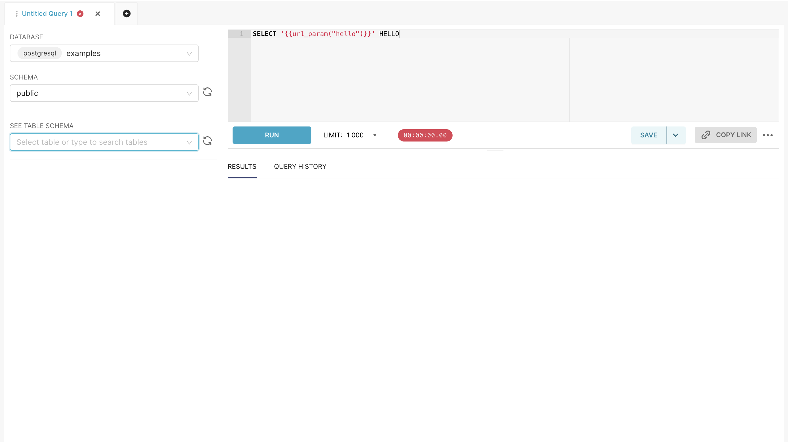

# 😁 Embedded Byteark Superset

## Prerequisites

Little things you need to do before start using embedded SDK

1. Enable embed dashboard feature


```diff
FEATURE_FLAGS = {
      ...
+      "EMBEDDED_SUPERSET": True,
+      "EMBEDDABLE_CHARTS": True,
    }

```


2. Config CORS to enable api requset from other origin you can read more [here](https://flask-cors.readthedocs.io/en/latest/api.html)


```yaml
ENABLE_CORS = True
CORS_OPTIONS = {
    "supports_credentials": True, # allow to pass creential from other origin
    "allow_headers": ['*'],
    "resources": ['*'],
    "origins": [
      "your-origin-here"
      ]
  }

```


3. Config public role to allow your guest to view dashboard

```yaml
PUBLIC_ROLE_LIKE = 'Gamma'
```

4. Config Superset url , Admin username ,and Admin password

```yaml
SUPERSET_URL = "https://byteark.lighthouse.dev2.poring.arkcube.com"
SUPERSET_ADMIN_USERNAME = "admin"
SUPERSET_ADMIN_PASSWORD = "**********"
```

## Installation

### Vanilla JS

1. Install `@superset-ui/embedded-sdk` package from npm


```sh
> npm i @superset-ui/embedded-sdk
```


2. Create a fetch guest token function

<pre class="language-typescript" data-title="index.ts"><code class="lang-typescript">const fetchGuestToken = async () => {
  const res = await axios.post&#x3C;{ token: string }>(
    "https://xxxx.arkcube.com/api/v1/guest/get_guest_token",
    {
      resources: [
        {
          id: &#x3C;DASHBOARD-ID>,
          type: "dashboard",
        },
      ],
      rls: [],
      user: {
        username: &#x3C;USERNAME>,
        first_name: &#x3C;FIRST-NAME>,
        last_name: &#x3C;LAST-NAME>,
      },
<strong>    }
</strong>  );
  
  return res.data.token;
};

</code></pre>

2. use `embedDashboard` function to start embed superset dashboard into your site

you can get `DASHBOARD-ID` from Superset Website at Embed Dashboard

<figure><figcaption><p>How to get DASHBOARD-ID for embed dashboard</p></figcaption></figure>

<pre class="language-typescript" data-title="index.ts"><code class="lang-typescript"><strong>embedDashboard({
</strong>      supersetDomain: &#x3C;SUPERSET-URL>,
      mountPoint: document.getElementById("mount-here"),
      fetchGuestToken: fetchGuestToken,
      id: &#x3C;DASHBOARD-ID>,
      dashboardUiConfig: {
           hideTitle: true,
           filters: {
               expanded: true,
           },
      },
});
</code></pre>

3. Create a html tag that can add `iframe` tag inside


```markup
<div id="mount-here"></div>
```


### React JS

1. Install `useEmbedded` hook from npm


```sh
> npm i byteark-lighthouse/useEmbedded
```


2. import hook to your react file


```typescript
import useEmbeddedDashboard from 'byteark-lighthouse/useEmbeddedDashboard'
```



```typescript
const { embeddedRef } = useEmbeddedDashboard({
  dashboardId: <DASHBOARD_ID>,
  permissions: {
    resources: [
      {
        id: <DASHBOARD_ID>,
        type: "dashboard",
      },
    ],
    rls: [],
    user: {
      username: <USERNAME>,
      first_name: <FIRST_NAME>,
      last_name: <LAST_NAME>,
    },
  },
  dashboardUiConfig: {
    hideTitle: true,
    hideTab: true,
    hideChartControls: true,
    filters: {
      visible: false,
      expanded: false,
    },
  },
});

```


3. add ref to the html tag that you want to embed I frame into


```typescript
return <div ref={embeddedRef} />
```


## Get Guest token from api

`POST` https://xxxx.arkcube.com/api/v1/guest/get\_guest\_token


```typescript
{
      resources: [
        {
          id: <DASHBOARD-ID>,
          type: "dashboard",
        },
      ],
      rls: [{ clause: <RLS-CLAUSE> }],
      user: {
        username: <USERNAME>,
        first_name: <FIRST-NAME>,
        last_name: <LAST-NAME>,
      },
}
```


### The workflow behind the scene of the api

> Why we need to create a new api when embed Aphache Superset dashboard ?

Because Apache Superset want to make sure that who make an api call is the trusted and allowed to grant guest token

So We need to create an api call to Authentication as an admin user to get a JWT Token from Superset and then use to get a CSRF Token (use at the embed Iframe) and create a Guest token

After we have created a Guest token then response that token to the client

<figure><figcaption><p>Request Workflow for Embed Dashboard</p></figcaption></figure>

## Prefilters

There are 2 ways to prefilter the embed dashboard.&#x20;

### RLS (Row Level Security)

this method can limit data that guest user can access by row using clauses. For more info [here](https://docs.preset.io/docs/row-level-security-rls)

#### For example:

Only allow the user to view a Data that has project\_id = "mello" and video\_id = "UAxLrfRQQWxK"

**Vanilla JS**

add rls clause to the payload in the fetch guest token function

```diff
const fetchGuestToken = async () => {
  const res = await axios.post<{ token: string }>(
    "https://xxxx.arkcube.com/api/v1/get_guest_token",
    {
      resources: [
        {
          id: <DASHBOARD-ID>,
          type: "dashboard",
        },
      ],
-     rls: []
+     rls: [{ clause: "project_id = 'mello' },{ clause: "video_id = 'UAxLrfRQQWxK' }],
      user: {
        username: <USERNAME>,
        first_name: <FIRST-NAME>,
        last_name: <LAST-NAME>,
      },
    }
  );
  
  return res.data.token;
};
```

**React JS**

add rls in the argument of the `useEmbeddedDashboard` hook

```diff
const { embeddedRef } = useEmbeddedDashboard({
  dashboardId: <DASHBOARD_ID>,
  permissions: {
   ...
-    rls: []
+    rls: [{ clause: "project_id = 'mello' },{ clause: "video_id = 'UAxLrfRQQWxK' }],
   ...
  },
  dashboardUiConfig: {
    hideTitle: true,
    hideTab: true,
    hideChartControls: true,
    filters: {
      visible: false,
      expanded: false,
    },
  },
});
```

### URL Params

this method use url parameters to add dynamic query using [Jinja Template ](https://jinja.palletsprojects.com/en/3.1.x/)provide by Superset

First create a SQL with Jinja template like this

<figure><figcaption><p>Create SQL with Jinja template in SQLLab </p></figcaption></figure>

Then add `urlParams` key in the `dashboardUIConfig`

**Vanilla JS**


```diff
embedDashboard({
      supersetDomain: <SUPERSET-URL>,
      mountPoint: document.getElementById("mount-here"),
      fetchGuestToken: fetchGuestToken,
      id: <DASHBOARD-ID>,
      dashboardUiConfig: {
           hideTitle: true,
           filters: {
               expanded: true,
           },
           urlParams: {
+               hello: "Hello World",
           }
      },
});
```


**React JS**


```diff
const { embeddedRef } = useEmbeddedDashboard({
  ...
  dashboardUiConfig: {
    ...
    urlParams: {
+      hello: "Hello World",
    }
  },
});

```



## User

this part will explain what is user key is the embed payload. This payload is use when query dynamic SQL with [Jinja Template](https://jinja.palletsprojects.com/en/3.1.x/)&#x20;

```typescript
user: {
      username: "public_user",
      first_name: "public",
      last_name: "user",
    },
```

For example:

```
SELECT {{ current_username() }} AS Username
```

Read more : [Intro To Jinja Templating in Apache Superset](https://preset.io/blog/intro-jinja-templating-apache-superset/)
